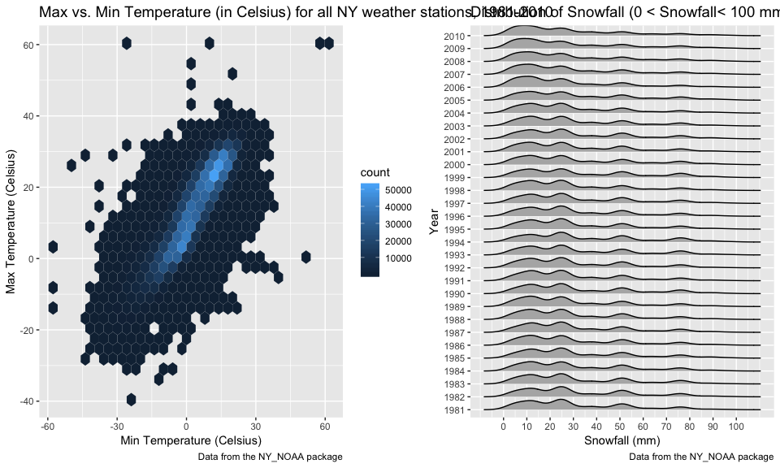

p8105\_hw3\_dm3175
================
Devon Morgan
10/15/2018

Problem 1
=========

The BRFSS dataset includes data from the Behavioral Risk Factors Surveillance System from 2002-2010. This dataset is located in the `p8105.datasets` package. The same dataset was used in homework 2.

Import and Clean Dataset
------------------------

Loaded and cleaned BRFSS data from `p9105.datasets` package:

``` r
brfss_data = p8105.datasets::brfss_smart2010 %>% 
    janitor::clean_names() %>%
    filter(topic == "Overall Health") %>% 
    mutate(response = factor(response, levels = c("Excellent", "Very good", "Good", "Fair", "Poor")))
```

The following steps were taken to clean the dataset:

-   Cleaned variable names using `janitor::clean_names`.

-   Verified variable types imported correctly.

-   Filtered data to only consider "Overall Health" topic.

-   Using the `factor` function, organized the responses as a factor ordered with 5 levels: `Excellent`, `Very good`, `Good`, `Fair`, and `Poor`.

Questions
---------

-   **In 2002, which states were observed at 7 locations?**

Using a combination of `group_by` and `summarize` functions, it can be found that in 2002, the following states were observed at 7 locations. Note that other states were observed at less than or greater than 7 locations.

``` r
brfss_data %>% 
  filter(year == 2002) %>% 
  group_by(locationabbr) %>% 
  summarize(count_locations = n_distinct(locationdesc)) %>% 
  filter(count_locations == 7) %>% 
  knitr::kable(digits = 1)
```

| locationabbr |  count\_locations|
|:-------------|-----------------:|
| CT           |                 7|
| FL           |                 7|
| NC           |                 7|

-   **Make a “spaghetti plot” that shows the number of locations in each state from 2002 to 2010.**

The following spaghetti plot displays the number of locations in each state from 2002 to 2010. The states are differentiated by colors as presented in the legend. The graph illustrates that the number of sampling locations in each state fluctuated from 2002 to 2010 and does not remain constant. It also demonstrates that the majority of states had &lt;10 sampling locations, with only 4 states sampling &gt;15 locations. Florida had the greatest number of sampling locations with a peak of 44 locations in 2007.

``` r
brfss_data %>%
  group_by(year, locationabbr) %>% 
  summarize(count_locations = n_distinct(locationdesc)) %>%
  ggplot(aes(x = year, y = count_locations, color = locationabbr)) + 
  geom_line(se = FALSE) +
  labs(
    title = "Number of Sampling Locations in Each State, 2002 to 2010",
    x = "Year",
    y = "Number of Distinct Sampling Locations",
    caption = "Data from the BRFSS 2010 Dataset"
  ) + 
  theme_bw()
```

    ## Warning: Ignoring unknown parameters: se


-   **Make a table showing, for the years 2002, 2006, and 2010, the mean and standard deviation of the proportion of “Excellent” responses across locations in NY State.**

The following table displays the mean and standard deviation of the proportion of "Excellent" responses across locations in NY State. The table displays that the highest mean of the proportion of "Excellent" responses was in 2002.

``` r
brfss_data %>% 
  filter(locationabbr == "NY" & 
           (year == 2002 | year == 2006 | year == 2010) &
           response == "Excellent") %>% 
  group_by(year) %>% 
  summarize(mean_excellent_response = mean(data_value),
            sd_excellent_response = sd(data_value)) %>%
  knitr::kable(digits = 1)
```

|  year|  mean\_excellent\_response|  sd\_excellent\_response|
|-----:|--------------------------:|------------------------:|
|  2002|                       24.0|                      4.5|
|  2006|                       22.5|                      4.0|
|  2010|                       22.7|                      3.6|

-   **For each year and state, compute the average proportion in each response category (taking the average across locations in a state). Make a five-panel plot that shows, for each response category separately, the distribution of these state-level averages over time.**

The following five-panel plot contains boxplots displaying the distribution of state-level averages over time separated by response category. First, the average proportion was computed within each response category (average was taken across locations in a state for each year). Next, the state-level averages were combined and plotted as a boxplot by year. A boxplot visualization was selected to demonstate how the distributions of state-level averages change over time. Boxplots are particularly helpful to visualize distributions.

``` r
brfss_data %>%
  mutate(year = as.character(year)) %>% 
  group_by(year, locationabbr, response) %>%
  summarize(mean_response = mean(data_value, na.rm = TRUE)) %>% 
  ggplot(aes(y = mean_response, x = year, color = response)) + 
    geom_boxplot() +
  facet_grid(~response) + 
  theme(axis.text.x = element_text(angle=60, hjust=1)) +
  labs(
      title = "Distribution of State-Level Mean Response Averages from 2002-2010, by Response Category",
      x = "Year",
      y = "Mean Response",
      caption = "Data from the BRFSS package"
    )
```


The boxplots illustrate that the distribution of mean state-level response averages remained fairly consistent from 2002 - 2010. This indicates that from year-to-year, the average proportion in each response category remained relatively constant when considering data from all states. The visualization does indicate that there are minor fluctuations from year-to-year, and outliers were observed in some years (see outliers illustrated by dots in the boxplot). The plot also demonstrates that the "Very Good" response consistently makes up the largest proportion every year, and the "Poor" response makes up the smallest.

Problem 2
=========

The Instacart Online Grocery Shopping Dataset (Instacart) from 2017 contains data from an online grocery service that permits shopping from local stores online, delivering groceries quickly. The dataset includes online order data from more than 200,000 users. This dataset is located in the `p8105.datasets` package.

Load dataset
------------

Loaded the instacart dataset from `p9105.datasets` package:

``` r
instacart_data = p8105.datasets::instacart %>% 
    janitor::clean_names()
```

Description of dataset
----------------------

The instacart dataset contains grocery delivery data from 131209 distinct online orders, and 1384617 total rows (representing all separate products processed during all orders). The dataset includes 39123 distinct product types purchased from 134 distinct aisles and 21 distinct departments.

### Variable Descriptions

The following is a list of all the variables (there are a total of 15 columns) within the dataset and corresponding descriptions for reference taken from the dataset description on <http://p8105.com/dataset_instacart.html>.

-   `order_id`: order identifier
-   `product_id`: product identifier
-   `add_to_cart_order`: order in which each product was added to cart
-   `reordered`: 1 if this prodcut has been ordered by this user in the past, 0 otherwise
-   `user_id`: customer identifier
-   `eval_set`: which evaluation set this order belongs in (Note that the data for use in this class is exclusively from the “train” eval\_set)
-   `order_number`: the order sequence number for this user (1=first, n=nth)
-   `order_dow`: the day of the week on which the order was placed
-   `order_hour_of_day`: the hour of the day on which the order was placed
-   `days_since_prior_order`: days since the last order, capped at 30, NA if order\_number=1
-   `product_name`: name of the product
-   `aisle_id`: aisle identifier
-   `department_id`: department identifier
-   `aisle`: the name of the aisle
-   `department`: the name of the department

Questions
---------

-   **How many aisles are there, and which aisles are the most items ordered from?**

There are 134 aisles noted in the dataset. The top 10 most frequently used aisles are displayed in the table below. These represent the aisles where the most ordered items originate from. The top three aisles are **fresh vegetables, fresh fruits, and packaged vegetable fruits**.

``` r
instacart_data %>% 
  group_by(aisle) %>% 
  summarize(distinct_aisle = n()) %>%
  filter(min_rank(desc(distinct_aisle)) < 11) %>% 
  arrange(desc(distinct_aisle)) %>% 
  knitr::kable(digits = 1)
```

| aisle                         |  distinct\_aisle|
|:------------------------------|----------------:|
| fresh vegetables              |           150609|
| fresh fruits                  |           150473|
| packaged vegetables fruits    |            78493|
| yogurt                        |            55240|
| packaged cheese               |            41699|
| water seltzer sparkling water |            36617|
| milk                          |            32644|
| chips pretzels                |            31269|
| soy lactosefree               |            26240|
| bread                         |            23635|

-   **Make a plot that shows the number of items ordered in each aisle. Order aisles sensibly, and organize your plot so others can read it**

The following plot displays the number of items ordered in each aisle, arranged from aisles containing fewest number of items ordered to greatest number of items ordered. The plot illustrates that the "Candy Chocolate" aisle has the most distinct products ordered, and "Bulk Dried Fruits" has the least.

``` r
instacart_data %>%
  group_by(aisle) %>% 
  summarize(distinct_product = n_distinct(product_id)) %>%
  arrange(desc(distinct_product)) %>%
  mutate(aisle = forcats::fct_reorder(aisle, desc(distinct_product))) %>% 
  ggplot(aes(x = aisle, y = distinct_product), color = aisle) +
  geom_point() +
  labs(
    title = "Number of Items Ordered by Aisle",
    x = "Aisle", 
    y = "Count of Distinct Products",
    caption = "Data from the Instacart package"
    ) +
  theme(axis.text.x=element_text(angle = 90, hjust = 1, vjust = 0.5),
        text=element_text(size = 8))
```


-   **Make a table showing the most popular item in each of the aisles “baking ingredients”, “dog food care”, and “packaged vegetables fruits”.**

The following tables shows the most popular item and corresponding frequency for how many times it was ordered in each of the following aisles: "baking ingredients", "dog food care", and "packaged vegetables fruits".

``` r
instacart_data %>%
  filter(aisle == "baking ingredients" | aisle == "dog food care" | aisle == "packaged vegetables fruits") %>% 
  group_by(aisle, product_name) %>%
  summarize(n_product = n()) %>%
  filter(min_rank(desc(n_product)) < 2) %>%
  knitr::kable(digits = 1)
```

| aisle                      | product\_name                                 |  n\_product|
|:---------------------------|:----------------------------------------------|-----------:|
| baking ingredients         | Light Brown Sugar                             |         499|
| dog food care              | Snack Sticks Chicken & Rice Recipe Dog Treats |          30|
| packaged vegetables fruits | Organic Baby Spinach                          |        9784|

-   **Make a table showing the mean hour of the day at which Pink Lady Apples and Coffee Ice Cream are ordered on each day of the week; format this table for human readers (i.e. produce a 2 x 7 table).**

The following table shows the mean hour of the day at which Pink Lady Apples and Coffee Ice Cream are ordered on each day of the week. Data is presented for each day of the week with a value of "0" in `order_dow` assumed to represent "Sunday". The day of week numerical values were renamed in the output table for improved readability.

``` r
hr_apple_coffee_dow = instacart_data %>%
  filter(product_name == "Pink Lady Apples" | product_name == "Coffee Ice Cream") %>% 
  group_by(product_name, order_dow) %>% 
  summarize(mean_hour = mean(order_hour_of_day)) %>%
  spread(key = order_dow, value = mean_hour)

hr_apple_coffee_dow %>% 
  rename(Sunday = `0`,
         Monday = `1`,
         Tuesday = `2`,
         Wednesday = `3`,
         Thursday = `4`,
         Friday = `5`,
         Saturday = `6`) %>% 
  knitr::kable(digits = 3)
```

| product\_name    |  Sunday|  Monday|  Tuesday|  Wednesday|  Thursday|  Friday|  Saturday|
|:-----------------|-------:|-------:|--------:|----------:|---------:|-------:|---------:|
| Coffee Ice Cream |  13.774|  14.316|   15.381|     15.318|    15.217|  12.263|    13.833|
| Pink Lady Apples |  13.441|  11.360|   11.702|     14.250|    11.552|  12.784|    11.938|

Problem 3
=========

Problem 3 uses data from the NOAA National Climatic Data Center describing weather patterns at different stations in New York State. This dataset is located in the `p8105.datasets` package.

Load dataset
------------

Loaded the NY\_NOAA dataset from `p9105.datasets` package:

``` r
NOAA_data = p8105.datasets::ny_noaa %>% 
    janitor::clean_names()
```

Description of dataset
----------------------

The NOAA dataset contains data from the NOAA National Climatic Data Center retrieved on August 15, 2017 specifically from New York state. The dataset contains 2595176 rows and 7 columns. The earliest observation time point began in 1981-01-01 and the last date of observation was 2010-12-31.

The dataset contains the following key variables:

-   `id`: ID of the weather center
-   `date`: Date of observation
-   `prcp`: Precipitation level (tenths of mm)
-   `snow`: Snowfall (mm)
-   `snwd`: Snow depth (mm)
-   `tmax`: Maximum temperature (tenths of degrees C)
-   `tmin`: Minimum temperature (tenths of degrees C)

Each of the weather stations collect a different combination of variables listed above. This means that there are a **significant amount of missing values** throughout the dataset. The missing value counts for each variable are as follows:

-   Precipitation level (`prcp`) has 145838 missing values. This represents 0.056 proportion missing values for this variable out of the full dataset.
-   Snowfall level (`snow`) has 381221 missing values. This represents 0.147 proportion missing values for this variable out of the full dataset.
-   Snow depth (`snwd`) has 591786 missing values. This represents 0.228 proportion missing values for this variable out of the full dataset.
-   Maximum temperature (`tmax`) has 1134358 missing values. This represents 0.437 proportion missing values for this variable out of the full dataset.
-   Minimum temperature (`tmin`) has 1134420 missing values. This represents 0.437 proportion missing values for this variable out of the full dataset.

The large number of missing values for `tmax` and `tmin` relative to the full size of the dataset (displayed above) make it difficult to track changes in temperature over time, and to get a clear sense of what the typical minimum and maximum temperature levels are at different stations. This similarly applies to the missing values for precipitation level, snowfall level and snow depth which make comparisons across stations and throughout time difficult.

Questions
---------

-   **Do some data cleaning. Create separate variables for year, month, and day. Ensure observations for temperature, precipitation, and snowfall are given in reasonable units. For snowfall, what are the most commonly observed values? Why?**

Next, the dataset was cleaned:

``` r
clean_NOAA_data = NOAA_data %>% 
  separate(date, into = c("year", "month", "day"), sep = "-") %>% 
  mutate(tmin = as.double(tmin), 
         tmax = as.double(tmax),
         prcp = as.double(prcp), 
         snow = as.double(snow),
         snwd = as.double(snwd),
         month = as.integer(month)) %>% 
  mutate(tmax_celsius = tmax/10,
         tmin_celsius = tmin/10,
         prcp_mm = prcp/10,
         month = month.name[month]) %>%
  select(id, day, month, year, snow, snwd, prcp_mm, tmax_celsius, tmin_celsius)
```

The following steps were completed to clean the dataset:

-   Separated the date column into separate variables for `year`, `month` and `day`.

-   Converted the month number to a month name.

-   Converted the weather measurement variables into "double" type variables.

-   Converted the unit for tmax, tmin and precipitation from tenths of degrees Celsius to degrees Celsius by diving the value by 10. This makes ensures the values are more understandable for a general audience.

-   Reordered the columns in a more logical way using the `select` function.

The most commonly observed values for snowfall was **0 mm**. The following is a count of the number of **0 mm** observations for snowfall variable `snow`. No snowfall is the most commonly observed value because for most days of observation in New York State, snowfall should be unlikely because New York State is not a particularly cold climate with large quantities of snowfall.

``` r
clean_NOAA_data %>% 
  count(snow) %>% 
  pull(n) %>% 
  max()
```

    ## [1] 2008508

-   **Make a two-panel plot showing the average max temperature in January and in July in each station across years. Is there any observable / interpretable structure? Any outliers?**

The following plot shows the average max temperature in January and July in each station from 1981 to 2010. The average max temperature was taken over all daily Tmax measurements for the months of July and January per station. A spaghetti plot was chosen to display the fluctuations in each station's average maximum temperature from year-to-year, and more clearly show outliers where they appear.

``` r
clean_NOAA_data %>%
  filter(month == "January" | month == "July") %>%
  group_by(id, year, month) %>% 
  summarize(mean_tmax = mean(tmax_celsius, na.rm = TRUE)) %>% 
  ggplot(aes(x = year, y = mean_tmax, group = id, color = id)) +
  geom_point() +
  geom_line() +
  facet_grid(. ~ month) +
  theme(axis.text.x = element_text(angle=60, hjust=1)) +
  labs(
    title = "Average maximum temperature in January and July for each NY State station, 1981-2010",
    x = "Year",
    y = "Mean Tmax",
    caption = "Data from the NY_NOAA package"
  ) +
  theme(axis.text.x = element_text(angle = 90)) + theme(legend.position = "none")
```

    ## Warning: Removed 5970 rows containing missing values (geom_point).

    ## Warning: Removed 5640 rows containing missing values (geom_path).


As expected, the plots illustrate that the average maximum temperature is consistently lower in Janurary than July. The average temperatures have fluctuated yearly from 1981-2010 displaying a zig-zag pattern of temperatures rising and then falling from year-to-year, although not always significantly. The most striking outliers in January maximum temperatures occurred in 1982 and 2005 (where unusually low maximum temperatures were observed), and an unusually high temperature was recorded in January 2004. The most striking outlier in the July maximum temperatures occurred in 1988. Other years with unusually low July temperatures occurred in 1984 and 1988.

-   **Make a two-panel plot showing (i) tmax vs tmin for the full dataset (note that a scatterplot may not be the best option); and (ii) make a plot showing the distribution of snowfall values greater than 0 and less than 100 separately by year.**

The following two-panel plot displays: 1) the Tmax vs. Tmin for the full dataset using a hexagonal scatterplot (`geom_hex()` function). This type of plot was chosen to avoid overplotting (due to the large amount of data in this dataset) and better represent the values most represented in the dataset using a color gradient by count; and 2) a `ggridges` density plot showing the distribution of snowfall values greater than 0 and less than 100 separately by year. The `geom_density_ridges` plot type was chosen because it allows for a clear comparison of distribution density plots at different time points.

``` r
temp_hex_p = clean_NOAA_data %>%
  ggplot(aes(x = tmin_celsius, y = tmax_celsius)) + 
  geom_hex() + 
  labs(title = "Max vs. Min Temperature (in Celsius) for all NY weather stations, 1981-2010",
       x = "Min Temperature (Celsius)",
       y = "Max Temperature (Celsius)",
      caption = "Data from the NY_NOAA package") + 
  theme(plot.title = element_text(size=10))

snowfall_density_p = clean_NOAA_data %>% 
  filter(snow > 0 & snow < 100) %>% 
  ggplot(aes(x = snow, y = year)) + 
  geom_density_ridges(scale = .85) +
  scale_x_continuous(breaks = c(0, 10, 20, 30, 40, 50, 60, 70, 80, 90, 100)) +
  labs(title = "Distribution of Snowfall (0 < Snowfall< 100 mm) by Year",
       x = "Snowfall (mm)",
       y = "Year",
      caption = "Data from the NY_NOAA package") + 
  theme(plot.title = element_text(size=10))

temp_hex_p + snowfall_density_p
```

    ## Warning: Removed 1136276 rows containing non-finite values (stat_binhex).

    ## Picking joint bandwidth of 3.76



The plot of maximum vs. minimum temperature illustrates that the Tmax and Tmin are not extremely tightly correlated because they do not follow a straight positive line and there are some outlier points extending in either direction. However, using the color gradient of count, the plot depicts that the majority of the data points fall along a relatively straight line.

The plot of the distribution of snowfall amounts between 0 mm and 100 mm by year illustrates that the distributions of snowfall are very consistent from year-to-year. Some fluctuations appear in the distribution from 2006 - 2010, as there appear to be a larger amount of data points in the 0 - 20 mm snowfall category since 2006 compared to earlier years measured.
